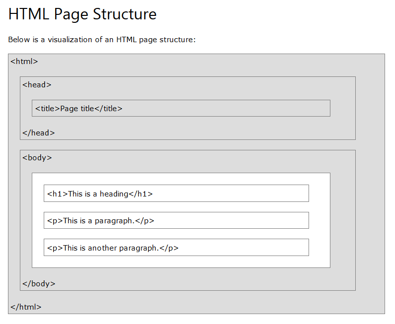

# Resumo das Tags <html>

## Histórico HTML

### Desde os primeiros dias da World Wide Web, existem muitas versões do HTML:

Ano       |  Versão
--------|------------------------------
Year 	| Version
1989 	| Tim Berners-Lee invented www
1991 	| Tim Berners-Lee invented HTML
1993 	| Dave Raggett drafted HTML+
1995 	| HTML Working Group defined HTML 2.0
1997 	| W3C Recommendation: HTML 3.2
1999 	| W3C Recommendation: HTML 4.01
2000 	| W3C Recommendation: XHTML 1.0
2008 	| WHATWG HTML5 First Public Draft
2012 	| WHATWG HTML5 Living Standard
2014 	| W3C Recommendation: HTML5
2016 	| W3C Candidate Recommendation: HTML 5.1
2017 	| W3C Recommendation: HTML5.1 2nd Edition
2017 	| W3C Recommendation: HTML5.2

## Estrutura

Tags   | Funcionalidade
--------- | -----------------------
!DOCTYPE | declaração define que este documento é um documento HTML5
html | elemento é o elemento raiz de uma página HTML
head | elemento contém meta informações sobre a página HTML
title | elemento especifica um título para a página HTML (que é mostrada na barra de título do navegador ou na guia da página)
body | elemento define o corpo do documento e é um contêiner para todo o conteúdo visível, como títulos, parágrafos, imagens, hiperlinks, tabelas, listas, etc.
h1 - h6	| elemento define um cabeçalho com diversos tamanhos começando pelo maior h1
p	| elemento define um parágrafo

## Tags de comentário HTML

Você pode adicionar comentários à sua fonte HTML usando a seguinte sintaxe: < br >
<-!-- Write your comments here --> 

## Tags de Link e seus Atributos

Links HTML - O atributo de destino

Tags   | Funcionalidade
--------- | ---------
a | Os links HTML são definidos com a tag.

Por padrão, a página vinculada será exibida na janela atual do navegador. Para alterar isso, você deve especificar outro destino para o link.

O target atributo especifica onde abrir o documento vinculado.

**O target atributo pode ter um dos seguintes valores:**

    _self- Padrão. Abre o documento na mesma janela / guia em que foi clicado
    _blank - Abre o documento em uma nova janela ou guia
    _parent - Abre o documento no quadro pai
    _top - Abre o documento no corpo inteiro da janela

## Atributos
blockquote cite="https://www.w3schools.com/html/html_attributes.asp"
	  p Todos os elementos HTML podem ter atributos
    O href atributo de **a** especifica o URL da página para a qual o link vai
    O src atributo de **img** especifica o caminho para a imagem a ser exibida
    Os widthe height atributos de imgfornecer informações de tamanho para imagens
    O alt atributo de **img** fornece um texto alternativo para uma imagem
    O style atributo é usado para adicionar estilos a um elemento, como cor, fonte, tamanho e mais
    O lang atributo da **htm** tag declara o idioma da página da Web
    O titlea tributo define algumas informações extras sobre um elemento.
</blockquote>
    
## Exibição em HTML

Tags   | Funcionalidade
-------- | ---------------
 p | This is a paragraph. p
 **p** |This is another paragraph.< /p > 
< hr > | tag define uma quebra temática em uma página HTML e é mais frequentemente exibida como uma regra horizontal.
< br > | elemento HTML define uma quebra de linha.
< pre > | elemento HTML define o texto pré-formatado.

## Elementos de formatação HTML

### Os elementos de formatação foram projetados para exibir tipos especiais de texto:

   * < b > - Texto em negrito
   * < strong > - texto importante
   * < i > - texto em itálico
   * < em > - Texto enfatizado
   * < mark > - Texto marcado
   * < small > - Texto menor
   * < del > - Texto excluído
   * < ins > - texto inserido
   * < sub > - Texto subscrito
   * < sup > - Texto sobrescrito

## Elementos de cotação e citação HTML

Tag 	| Funcionalidade
------ |-------------------
< abbr > 	|tag HTML define uma abreviação ou acrônimo, como "HTML", "CSS", "Mr.", "Dr.".
< address > | tag HTML define as informações de contato do autor.
< bdo > 	| tag HTML é usada para substituir a direção do texto atual:
< blockquote > |	elemento HTML define uma seção que é citada de outra fonte.
< cite > 	| tag HTML define o título de um trabalho criativo.
< q > 	| tag HTML define uma citação curta.

## Sintaxe de imagens HTML

* A < img > tag HTML é usada para incorporar uma imagem em uma página da web.

* A < img > tag possui dois atributos obrigatórios:

  -  src - especifica o caminho para a imagem
  -  alt - Especifica um texto alternativo para a imagem

___________________________________________________________________________

 ## Tags de imagem HTML

Tag 	| Description
--------| ------------------
< img > 	|Defines an image
< map > 	|Defines an image map
< area >  	|Defines a clickable area inside an image map
< picture > 	|Defines a container for multiple image resources

**Exemplo**

< img src="imagem.jpg" alt="Descrição da imagem" > 

**Formatos comuns de imagem**
______________________________________________________________________________

Aqui estão os tipos de arquivos de imagem mais comuns, suportados em todos os navegadores (Chrome, Edge, Firefox, Safari, Opera):

Abbreviation 	|File Format 	|File Extension
---------------|--------------|---------------------
APNG 	| Animated Portable Network Graphics 	|.apng
GIF 	| Graphics Interchange Format 	| .gif
ICO 	| Microsoft Icon 	| .ico, .cur
JPEG 	| Joint Photographic Expert Group image 	| .jpg, .jpeg, .jfif, .pjpeg, .pjp
PNG 	| Portable Network Graphics 	|.png
SVG 	| Scalable Vector Graphics 	| .svg

## Elemento <picture> HTML

O < picture >elemento HTML oferece aos desenvolvedores da Web mais flexibilidade na especificação de recursos de imagem.

O < picture >elemento contém um ou mais < source >elementos, cada um referente a imagens diferentes por meio do srcset atributo Dessa forma, o navegador pode escolher a imagem que melhor se ajusta à exibição e / ou dispositivo atual.

Cada < source > elemento possui um mediaatributo que define quando a imagem é a mais adequada.

